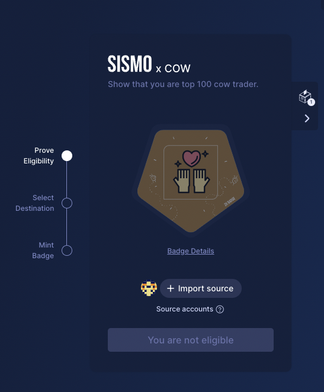
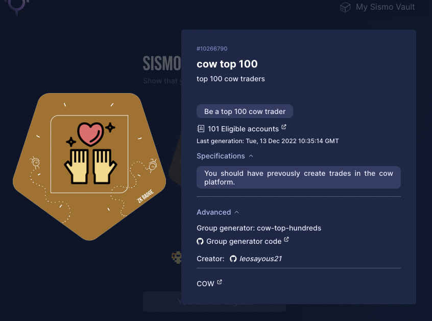

# Privacy Preserving CoW Swap Trader Leaderboard - Based on Sismo Badges

## status:
**local version with "real" users data has being made. marketing related design and text needed.**
once marketing provide the neccesry information the nadges would go online

## what is missing for going online
I am currently missing the below marketing metadata to be able to move forward

### Main url
```js
  {
    path: "CoW Swap Trader Badges",
    title: "CoW Swap",
    subtitle: "Show that you are a special CoW, claim your trader badge!",
    logoUrl: "https://cow.fi/images/hero-image.svg",
    onboardingDescription: "Mint this badge to show that you are a unique CoW Swap trader",
    ctaLabel: "What are you waiting for? Trade today at swap.cow.fi",
    ctaUrl: "https://cow.fi/",
    congratulationTexts: ["Moooooo-d work CoW],
   },
```



### Badge url
If the user want more details, one can press on the badge and the bellow image would appear. Here one can find the data need to change

```js
    {
      name: "Top 100 CoW Trader", // add a name to your badge
      description: "Top 100 CoW Trader", // describe it !
      image: "cow_top_100.svg", // this is the svg path can be create easily from here https://factory.sismo.io/svg-editor
      publicContacts: [
        // give us a way to join you :)
        {
          type: "github", // github | twitter | lens ...
          contact: "leosayous21", // your username
        },
      ],
      eligibility: {
        // provide a short description of your eligibility criterias
        shortDescription: "According to aggregate 2022 volumes, you're a top 100 CoW trader",
        // provide a technical description of your eligibility criterias
        specification:
          "According to aggregate 2022 volumes, you've traded more than $xxx",
      },
      links: [
        {
          logoUrl: "https://cow.fi/images/og-meta-cowprotocol.png", // a nice logo to have next to the url
          label: "COW", // label for your url
          url: "https://cow.fi/", 
        },
      ],
    },
    {
      name: "Top 1000 CoW Trader", // add a name to your badge
      description: "Top 1000 CoW Trader", // describe it !
      image: "cow_top_1000.svg", // this is the svg path can be create easily from here https://factory.sismo.io/svg-editor
      publicContacts: [
        // give us a way to join you :)
        {
          type: "github", // github | twitter | lens ...
          contact: "leosayous21", // your username
        },
      ],
      eligibility: {
        // provide a short description of your eligibility criterias
        shortDescription: "According to aggregate 2022 volumes, you're a top 1000 CoW trader",
        // provide a technical description of your eligibility criterias
        specification:
          "According to aggregate 2022 volumes, you've traded more than $xxx",
      },
      links: [
        {
          logoUrl: "https://cow.fi/images/og-meta-cowprotocol.png", // a nice logo to have next to the url
          label: "COW", // label for your url
          url: "https://cow.fi/", 
        },
      ],
    },
    {
      name: "Top 5000 CoW Trader", // add a name to your badge
      description: "Top 5000 CoW Trader", // describe it !
      image: "cow_top_5000.svg", // this is the svg path can be create easily from here https://factory.sismo.io/svg-editor
      publicContacts: [
        // give us a way to join you :)
        {
          type: "github", // github | twitter | lens ...
          contact: "leosayous21", // your username
        },
      ],
      eligibility: {
        // provide a short description of your eligibility criterias
        shortDescription: "According to aggregate 2022 volumes, you're a top 5000 CoW trader",
        // provide a technical description of your eligibility criterias
        specification:
          "According to aggregate 2022 volumes, you've traded more than $xxx",
      },
      links: [
        {
          logoUrl: "https://cow.fi/images/og-meta-cowprotocol.png", // a nice logo to have next to the url
          label: "COW", // label for your url
          url: "https://cow.fi/", 
        },
      ],
    },
    {
      name: "cow top 15000", // add a name to your badge
      description: "top 15000 cow traders", // describe it !
      image: "cow_top_15000.svg", // this is the svg path can be create easily from here https://factory.sismo.io/svg-editor
      publicContacts: [
        // give us a way to join you :)
        {
          type: "github", // github | twitter | lens ...
          contact: "leosayous21", // your username
        },
      ],
      eligibility: {
        // provide a short description of your eligibility criterias
        shortDescription: "Be a top 15000 cow trader",
        // provide a technical description of your eligibility criterias
        specification:
          "You should have prevously create trades in the cow platform.",
      },
      links: [
        {
          logoUrl: "https://cow.fi/images/og-meta-cowprotocol.png", // a nice logo to have next to the url
          label: "COW", // label for your url
          url: "https://cow.fi/", 
        },
      ],
    },
    {
      name: "CoW Trader", // add a name to your badge
      description: "CoW Trader", // describe it !
      image: "cow_top_100.svg", // this is the svg path can be create easily from here https://factory.sismo.io/svg-editor
      publicContacts: [
        // give us a way to join you :)
        {
          type: "github", // github | twitter | lens ...
          contact: "leosayous21", // your username
        },
      ],
      eligibility: {
        // provide a short description of your eligibility criterias
        shortDescription: "Anyoe that have traded on CoW Swap in 2022",
        // provide a technical description of your eligibility criterias
        specification:
          "Anyoe that have traded on CoW Swap in 2022",
      },
      links: [
        {
          logoUrl: "https://cow.fi/images/og-meta-cowprotocol.png", // a nice logo to have next to the url
          label: "COW", // label for your url
          url: "https://cow.fi/", 
        },
      ],
    },
```




## useful links:
[sismo docs](https://docs.sismo.io/sismo-docs/)
[create your own badge](https://factory.sismo.io/svg-editor)
